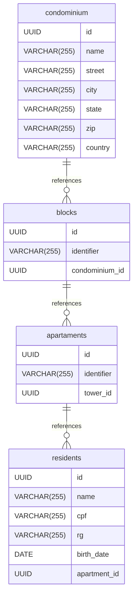

## Diagrama relacional do banco de dados

```mermaid
erDiagram
blocks ||--o{ apartaments : references
condominium ||--o{ blocks : references
apartaments ||--o{ residents : references

	condominium {
		UUID id
		VARCHAR(255) name
		VARCHAR(255) street
		VARCHAR(255) city
		VARCHAR(255) state
		VARCHAR(255) zip
		VARCHAR(255) country
	}

	apartaments {
		UUID id
		VARCHAR(255) identifier
		UUID tower_id
	}

	residents {
		UUID id
		VARCHAR(255) name
		VARCHAR(255) cpf
		VARCHAR(255) rg
		DATE birth_date
		UUID apartment_id
	}

	blocks {
		UUID id
		VARCHAR(255) identifier
		UUID condominium_id
	}
```
https://www.drawdb.app/editor?shareId=e669229754af60f8f9928c228a6dcebb
