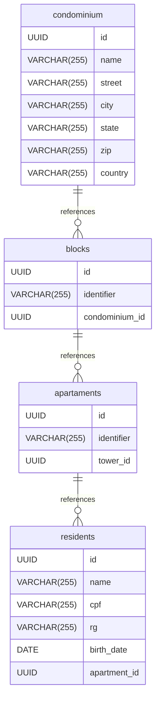

# 🏢 Condominium Management API

API desenvolvida em **Java 21** com **Spring Boot 3.5.6** para o gerenciamento de condomínios, blocos, apartamentos e residentes.
O projeto utiliza **JPA/Hibernate**, banco de dados **PostgreSQL** e é executado via **Docker Compose**.

---

## 🚀 Tecnologias Utilizadas

* **Java 21**
* **Spring Boot 3.5.6**
* **Spring Web**
* **Spring Data JPA**
* **PostgreSQL**
* **Docker Compose**
* **Maven**

---

## 🧱 Modelo de Dados

O sistema segue o seguinte modelo relacional:



🔗 [Visualizar no DrawDB](https://www.drawdb.app/editor?shareId=e669229754af60f8f9928c228a6dcebb)

---

## 🐳 Executando com Docker Compose

### 1. Use o arquivo `docker-compose.yml` na raiz do projeto

```yaml
version: '3.8'

services:
  db:
    image: postgres:16
    container_name: postgres_condominium
    environment:
      POSTGRES_USER: admin
      POSTGRES_PASSWORD: admin
      POSTGRES_DB: condominiumdb
    ports:
      - "5432:5432"
    volumes:
      - pgdata:/var/lib/postgresql/data
    networks:
      - condominium-net

  app:
    build: .
    container_name: condominium_api
    depends_on:
      - db
    environment:
      SPRING_DATASOURCE_URL: jdbc:postgresql://db:5432/condominiumdb
      SPRING_DATASOURCE_USERNAME: admin
      SPRING_DATASOURCE_PASSWORD: admin
    ports:
      - "8081:8081"
    networks:
      - condominium-net

volumes:
  pgdata:

networks:
  condominium-net:
```

### 2. Execute o ambiente

```bash
docker compose up --build
```

A aplicação ficará disponível em:
👉 **[http://localhost:8081](http://localhost:8081)**

---

## ⚙️ Configuração do `application.yml`

```yaml
server:
  port: 8081

spring:
  datasource:
    url: jdbc:postgresql://localhost:5432/condominiumdb
    username: admin
    password: admin
  jpa:
    hibernate:
      ddl-auto: update
    show-sql: true
```

---

## 📬 Coleção Postman

Para testar todos os endpoints da API, importe o arquivo Postman:

📁 [`vagnersiqueirajuniorapi-infnet-java-class.postman_collection.json`](./postman_collection.json)

Endpoints disponíveis:

* **Condominiums**

    * `POST /condominiums`
    * `GET /condominiums`
    * `GET /condominiums/{id}`
    * `PUT /condominiums/{id}`
    * `DELETE /condominiums/{id}`
* **Blocks**

    * `POST /condominiums/{condominiumId}/blocks`
    * `GET /condominiums/{condominiumId}/blocks`
    * `GET /condominiums/{condominiumId}/blocks/{blockId}`
    * `PUT /condominiums/{condominiumId}/blocks/{blockId}`
    * `DELETE /condominiums/{condominiumId}/blocks/{blockId}`
* **Apartments**

    * `POST /condominiums/{condominiumId}/blocks/{blockId}/apartments/generate`
    * `POST /condominiums/{condominiumId}/blocks/{blockId}/apartments/list`
    * `GET /condominiums/{condominiumId}/blocks/{blockId}/apartments`
    * `GET /condominiums/{condominiumId}/blocks/{blockId}/apartments/{apartmentId}`
    * `PUT /condominiums/{condominiumId}/blocks/{blockId}/apartments/{apartmentId}`
    * `DELETE /condominiums/{condominiumId}/blocks/{blockId}/apartments/{apartmentId}`

---

## 🧪 Exemplo de Requisição

### Criar um Condomínio

**POST** `http://localhost:8081/condominiums`

```json
{
  "name": "Le Vin",
  "street": "Estrada do Beija Flor",
  "city": "Mogi das Cruzes",
  "state": "SP",
  "zipcode": "0884050",
  "country": "BR",
  "number": "290"
}
```

### Resposta

```json
{
  "id": "b0dd858f-edf6-4369-9c4b-8f5dbb13ce1c",
  "name": "Le Vin",
  "city": "Mogi das Cruzes",
  "state": "SP"
}
```

---

## 🧰 Comandos Úteis

| Comando                     | Descrição                               |
| --------------------------- | --------------------------------------- |
| `mvn clean install`         | Compila o projeto e baixa dependências  |
| `mvn spring-boot:run`       | Executa a aplicação localmente          |
| `docker compose up --build` | Sobe o ambiente completo com PostgreSQL |
| `docker compose down -v`    | Remove containers e volumes             |

---

## 👨‍💻 Autor

**Vagner Siqueira Junior**
Projeto acadêmico INFNET — API de gerenciamento de condomínios
📚 Disciplina: *Desenvolvimento Java com Spring Boot*
📧 Contato: [[juniorterriaga0@gmail.com](mailto:juniorterriaga0@gmail.com)]
